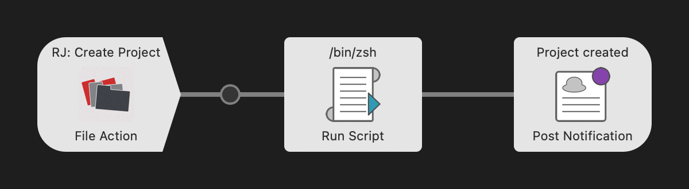
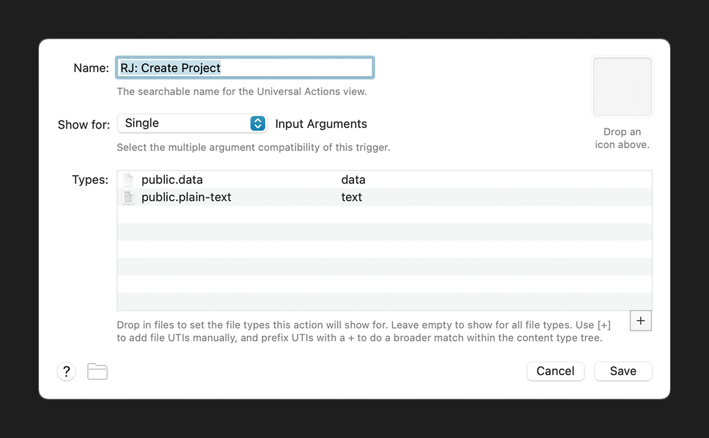
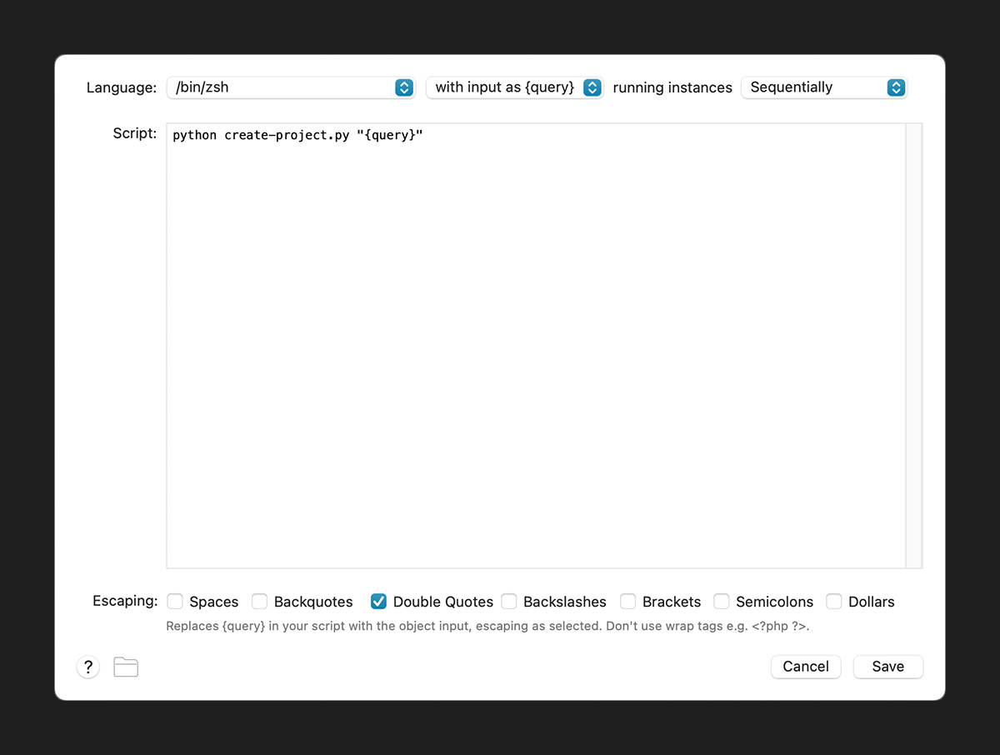
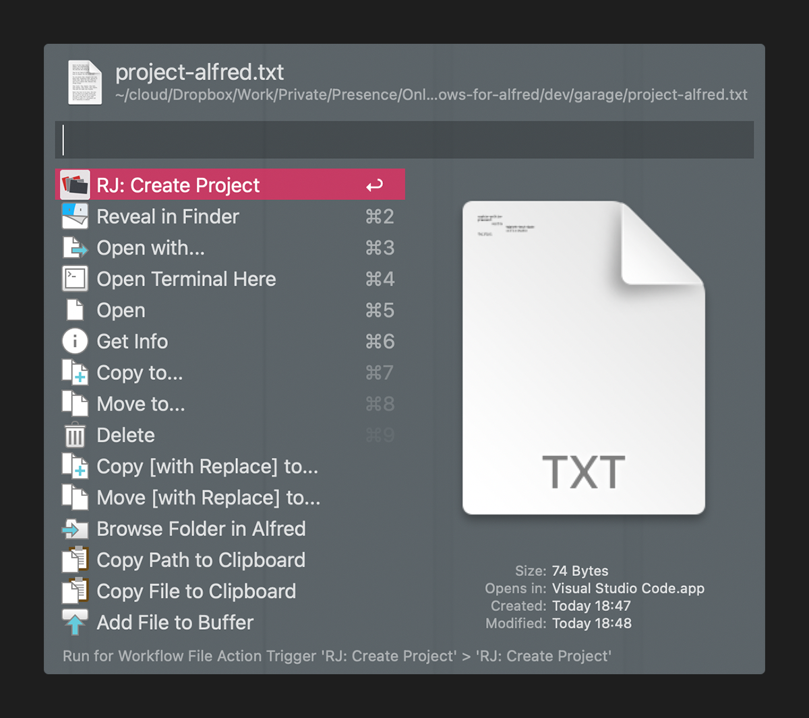

# Jerry’s Workflows for Alfred

*Some productivity workflows I have sporadically created thoughout the years.*

## RJ: Create Project

*This script creates a folder structure defined in a text file.*

### Prerequisites

- Python 3.x
- Alfred Powerpack

### Setup

Normally you won’t need to set it up, the workflow should work out of the box – in case you’d still need it, here is a breakdown:

#### The Workflow



#### The File Action



#### The Script



### Usage

Create an UTF-8 encoded text file – the *definition file*, select the it in Finder (or any file manager app), get Alfred actions panel (with the hotkey set in Preferences → Features → Universal Actions → Selection Hotkey), and run **RJ: Create Project**. The folder structure will be created where the *definition file* resides.



### Syntax

- One line represents a folder.
- Lines on the same indention level represent sibling folders.
- A positive indention to the previous line represents a subfolder.
- A negative indention to the previous line represents a parent folder.
- Indentions must be written with TAB characters.
- The script will replace the `%date%` string in the *definition file* with the actual date.

#### Example 1

Contents of the *definition file*:

```txt
root-folder-1
root-folder-2
	sub-folder-1
	sub-folder-2
	sub-folder-3
		sub-sub-folder-1
		sub-sub-folder-2
	sub-folder-4
root-folder-3
```

#### Example 2

Contents of the *definition file*:

```txt
root-folder-1
%root-%date-folder-2
	sub-folder-1
	sub-folder-2
		sub-sub-%date%-folder-1
		sub-sub-folder-2
	%date%
root-folder-3
```

## Downloads

- [RJ: Create Project](https://github.com/Royaljerry/jerrys-workflows-for-alfred/raw/master/dist/rj-create-project.alfredworkflow)

## Contact

Adam Pócs

- [Email](mailto:royaljerry@gmail.com)
- [Facebook](https://www.facebook.com/royaljerry)
- [Portfolio](https://royaljerry.myportfolio.com/)
- [GitHub](https://github.com/Royaljerry)
- [LinkedIn](https://www.linkedin.com/in/royaljerry/)

## Copyright

These workflows and scripts are licensed under [The Unlicense](https://choosealicense.com/licenses/unlicense/) license.