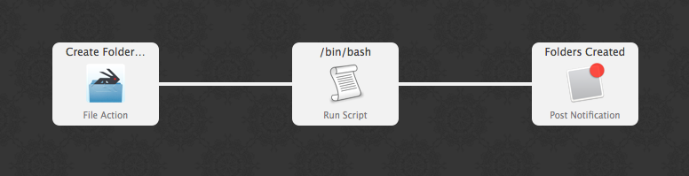
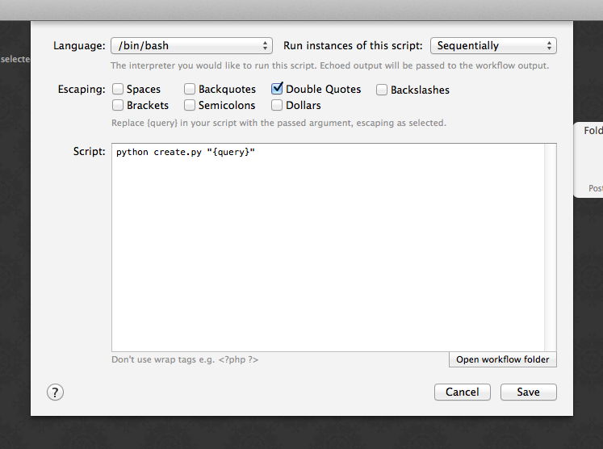
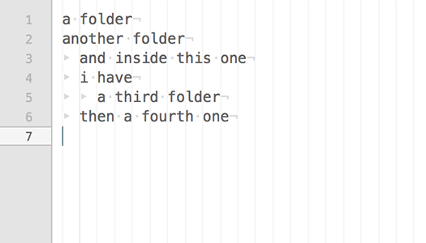
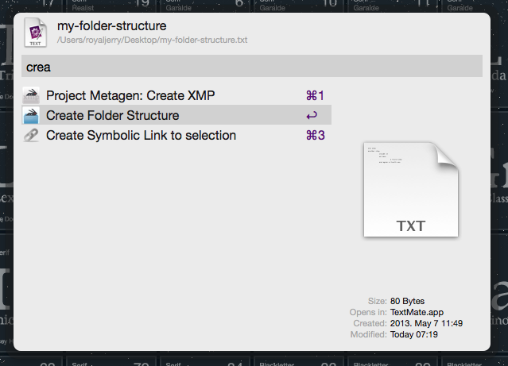

# Jerry’s Workflows for Alfred

*Some productivity workflows I have sporadically created thoughout the years.*

## Create Folder Structure

:warning: **This Workflow is deprecated, since it uses Python 2.x. It will be rewritten in Python 3.**

*This script creates a folder structure defined in a text file.*

### Prerequisites

- Python 2.x
- Alfred Powerpack

### Setup

Normally you won’t need to set it up, the workflow should work out of the box – in case you’d still need it, here are the details of the settings:





### Usage

Create an UTF-8 encoded text file – the _definition text file_ (e.g. in TextEdit), and start typing folder names, row by row, one after another. Each entry (folder to be created) must be placed in a unique row. If a subfolder is required, indent it with a tab. Folder names can contain any legal characters the OS X supports.



Then select _this file_ in Finder, open Alfred, and run “Create Folder Structure”. It will create the folder structure in the current Finder folder.



### Syntax

The syntax of the _definition text file_ looks :

```txt
a folder
another folder
	and inside this one
	i have
		a third folder
	then a fourth one
```

One extra feature: the script will replace the `%date%` string in the definition file with the actual date.
